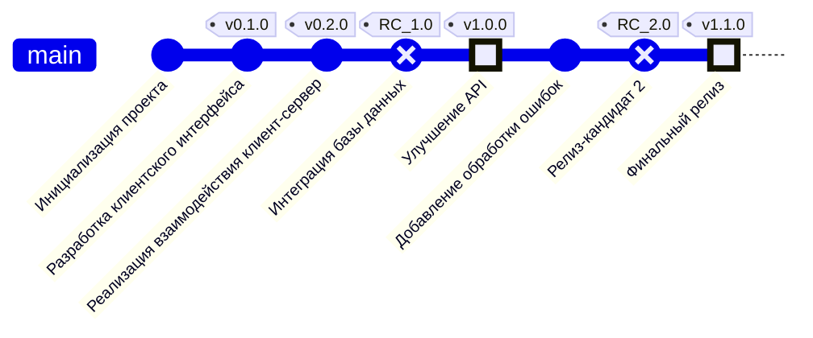

## Гит граф (Git Graph)

### Пояснение диаграммы
Гит-граф отображает процесс разработки системы с точки зрения управления
версиями и этапов реализации. Каждое изменение в коде представлено коммитами, сгруппированными по этапам и помеченными тегами для обозначения значимых версий и релизов.

Этапы разработки:
1. Инициализация проекта:

  * Проект стартует с создания базовой структуры. В этот этап обычно включается настройка репозитория, базовые конфигурации системы и установка окружения разработки.
2. Разработка клиентского интерфейса (v0.1.0):

  * В этом этапе создается веб-интерфейс для пользователей. Это могут быть страницы регистрации, авторизации и оформления заказов. Основной акцент сделан на фронтенд-части системы.
3. Реализация взаимодействия клиент-сервер (v0.2.0):

  * Добавляется взаимодействие между фронтендом и серверной частью через API. На этом этапе серверная логика начинает обрабатывать запросы пользователей.
4. Интеграция базы данных (RC_1.0):
  * Реализуется подключение к базе данных, создание структуры хранения данных (например, таблиц для пользователей, заказов, услуг). Это значительный этап, так как он обеспечивает сохранность и доступ к данным.
5. Улучшение API (v1.0.0):

  * Оптимизация API-сервиса. На этом этапе могут быть добавлены новые эндпоинты, улучшена обработка ошибок или реализована поддержка дополнительных форматов данных.
6. Добавление обработки ошибок:

  * Внедрение механизмов, которые обеспечивают стабильность системы при возникновении исключений или некорректных запросов.
7. Релиз-кандидат 2 (RC_2.0):

  * Тестовая версия системы, готовая к выпуску. На этом этапе проверяются работоспособность всех модулей, интеграция между компонентами и общая стабильность системы.
8. Финальный релиз (v1.1.0):

  * Завершающий этап разработки. Все функции проверены, система готова к использованию в продакшене. Включает в себя итоговые доработки, такие как оптимизация производительности и улучшение пользовательского опыта.

Этапы разработки тесно связаны с функциональными частями системы, описанными в других диаграммах. Например, фронтенд-интерфейс из этапа "Разработка клиентского интерфейса" соответствует пользовательским функциям, показанным в User Journey Diagram.
Теги версий отражают завершение ключевых этапов, что позволяет отслеживать прогресс и вносить изменения на основе обратной связи.
Гит-граф помогает структурировать процесс разработки, разбивая его на логические части, и служит отличным инструментом для документации, особенно при командной работе.
